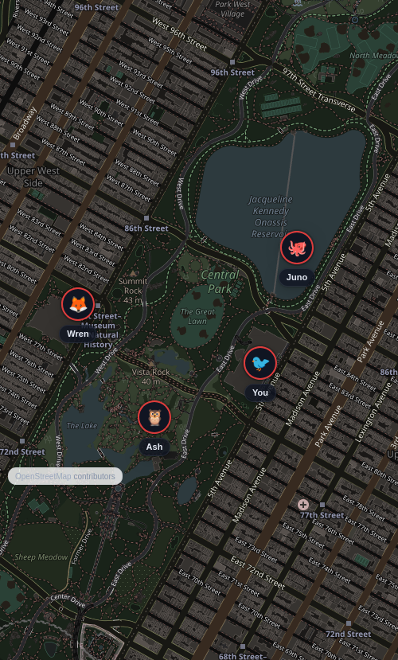
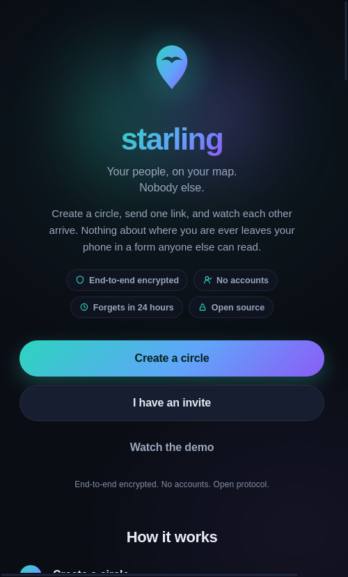
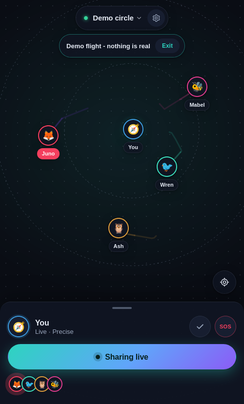
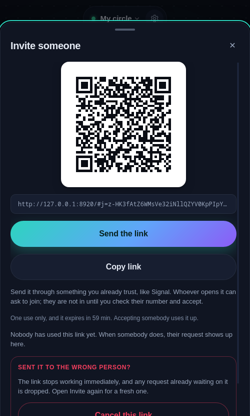
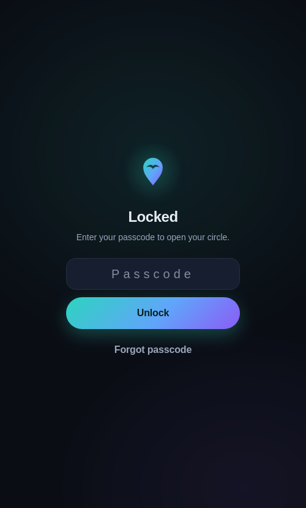

# starling

Private location sharing for friends and family. End to end encrypted, no
accounts, no phone numbers, and a relay that stores nothing it could ever read.

[](https://github.com/munzzyy/starling/actions/workflows/ci.yml)

**Live:** [starlingmap.app](https://starlingmap.app) ·
grab the Android app there.

This document describes protocol v2: forward secrecy, post-compromise
security, and cryptographic member removal. As of 0.5.0 it is wired end to
end, crypto core through relay through storage through UI, on both web and
Android, and 351 unit tests plus two headless-browser end to end suites
exercise it as a running app talking to a running relay. Nobody outside this
project has independently reviewed any of it. See
[docs/AUDIT.md](docs/AUDIT.md) for exactly what has and has not been
checked, including whether the live relay has actually been redeployed to
speak v2 yet.

Life360 works by shipping everyone's location to a company. Starling keeps the
Life360 features people actually want (live map of your people, SOS, check-ins,
battery, invite links) and drops the surveillance: positions are encrypted on
your device with a key the server never sees, and the relay holds at most 24
hours of ciphertext.

Circles are plural. Keep one for family and one for the friends you split up
from at a fair or a concert, and switch between them with a tap on the circle
name. Each circle has its own secret, its own channel, and its own signing
identity, so the relay cannot tell that two circles share a member. The map,
sharing, and invites all follow whichever circle is active.



## How it works

- Creating a circle generates its keys on your device. Inviting someone
  shares a one-time invite secret, in the URL fragment, which browsers never
  send to any server; it is not the circle's own key material, so a stolen
  invite link is only good for one join attempt, and only if you accept a
  safety number you were not expecting. Share the link over something you
  already trust, like Signal, the same as always.
- Locations are AES-256-GCM encrypted under a key that advances every 10
  minutes (HKDF-SHA-256, one hash step forward per epoch) and is destroyed
  the moment a device moves past it. A device seized after it has advanced
  cannot decrypt what it already forgot, and neither can anyone who takes it.
  Names, avatars, and statuses ride inside the ciphertext too. Every
  plaintext is padded to exactly 512 bytes so message sizes carry nothing.
- Each device signs its posts with its own Ed25519 key (P-256 fallback), and
  every receiving device checks that signature itself. The content key
  advances per member as well as per epoch, so it proves only that a message
  came from a key material holder; the signature is what says which member.
  The relay pins each key on first write, so nobody can overwrite your slot,
  and a strictly increasing (epoch, timestamp) rule kills replays, checked by
  every receiver, not just the relay.
- Removing someone from a circle re-keys it: a fresh chain, mixed with fresh
  key-exchange entropy, delivered to everyone except the member being
  removed. They get no wrap, derive no new keys, and cannot follow the
  circle to its next channel. That is what makes removal complete rather
  than a request the removed device can just ignore.
- The relay is a small Cloudflare Worker with a D1 table of ciphertext rows.
  It knows channel ids, ciphertext sizes, timing, and IPs. It never learns
  where you are or who your circle is. Rows expire after 24 hours, swept
  deterministically on every read and write.
- No push tokens, no analytics, no third party requests. The only external
  fetch in the whole app is OpenStreetMap tiles, and only when a street basemap
  is on; the Off-grid basemap renders locally and makes zero requests.
- Optional app lock encrypts the circle secret at rest behind a passcode
  (PBKDF2-SHA-256, 600k iterations) and, where the browser supports it, a
  biometric unlock through the WebAuthn PRF extension. A locked device holds no
  readable secret in memory or on disk.

The exact wire format and crypto are in [docs/PROTOCOL.md](docs/PROTOCOL.md).
What the relay can and cannot learn, stated honestly, is in
[docs/THREAT-MODEL.md](docs/THREAT-MODEL.md). Exactly which of it is wired
into a running app today, file by file, is in [docs/AUDIT.md](docs/AUDIT.md).
If the code and those files ever disagree, that is a bug.

## What it looks like

Dark-first UI. Draggable member sheet, live markers with eased motion, trails,
SOS hold-to-fire, check-ins, coarse mode (your device rounds your position to
about 1 km before encrypting), panic wipe, and a demo you can run without
sharing anything: open starlingmap.app and hit Watch the demo.

An SOS can also mint a help link. Your circle is a list you chose in advance,
and the person who can actually reach you may not be on it, so the link opens
your live position in any browser with no app and no account, for as long as
the emergency lasts. It shows that one emergency: not your circle, not its
other members, not any history. Checking in safe switches it off.

Circles are app-only by design. The hosted website is a landing page plus that
demo; it refuses to create or open circles, because a browser tab is the
weakest place to keep a long-lived location secret (extensions, shared
machines, no OS keystore). The full app still runs on localhost for
development and testing.

| Onboarding | The demo | Invite | App lock |
|---|---|---|---|
|  |  |  |  |

The `test/screenshots/` set is regenerated on every end to end run.

## Sharing model

Sharing is off until you turn it on, and stopping posts a signed goodbye so
your circle sees "stopped" instead of a stale dot. This is live-when-open
sharing like Signal's, not an always-on tracker: when the OS suspends the tab,
sharing pauses. That is the honest ceiling of the web platform, and the app
says so instead of pretending otherwise.

## Run it

No build step, no dependencies to install. Needs Node 24 or newer.

```
# unit tests: 351 as of this writing (crypto, wire, ratchet, rekey, membership,
# relay, QR, UI logic, lock, circles, manifest, and every committed test vector)
node --test test/*.test.mjs

# local dev server (app + relay on one origin)
node test/serve_local.mjs 8899

# the three headless-Firefox end to end suites (need a real Firefox; not run in CI)
python3 test/e2e_marionette.py   # sharing: create, invite, join, cross-visibility, check-in, SOS, help link, stop
python3 test/e2e_v2_ui.py        # safety-number comparison, review/accept, re-key, key-change warning, beacon revocation
python3 test/e2e_lock.py         # the app-lock lifecycle
```

The QR tests cross-check the encoder against the Python `qrcode` library when it
is installed (`pip install qrcode`); without it those checks skip rather than
fail, so a bare clone still runs green.

The e2e suites drive real headless Firefox profiles through the flows named
above, dump the relay database at the end, and assert no name and no
coordinate appears anywhere in it. Run them yourself rather than trust a
claim that they passed on some earlier date; [docs/AUDIT.md](docs/AUDIT.md)
has the exact commands and what each suite covers.

## Deploy

The relay and the app ship as one Cloudflare Worker with static assets. With a
Cloudflare API token in `CLOUDFLARE_API_TOKEN` (Workers Scripts, D1, and Account
Settings read), one command creates the database, applies the schema, and
deploys:

```
bash relay/deploy.sh
```

It is idempotent, so re-running it just ships the latest code. The hosted page
serves the landing and demo; sharing itself lives in the Android app.
Geolocation needs a secure context, so plain HTTP will not work anywhere.

Redeploying is what actually breaks v1: the relay answers `/api/v1/*` with
`410 Gone` rather than syncing an old client into a channel nobody else is
on. A v1 client cannot be upgraded in place to talk to a v2 relay, because v1
and v2 derive different channel ids from the same circle secret; every
existing circle has to be re-created after a v1-to-v2 relay upgrade. See the
[changelog](CHANGELOG.md) entry for 0.5.0.

The relay's rate limits are two vars in `relay/wrangler.toml`, both per minute:
`RATE_POST_MIN` (writes per channel, default 256) and `RATE_GET_MIN` (requests
per client address, reads and writes, default 240). They are sized so a full
16-member circle sharing normally never meets them, with room for re-key bursts
and movement posting; the arithmetic behind each number is in the comments next
to them. Raise `RATE_GET_MIN` if several circles reach you from one NAT, VPN
exit or Tor circuit, and `RATE_POST_MIN` if a whole circle shares while moving.
Changing them is a var edit and a redeploy, not a code change.

## QR codes

Invite QR codes are generated on-device by a from-scratch byte-mode encoder
(versions 1-10, EC level M, all masks). The test suite proves every matrix
byte-identical to the Python qrcode library across all mask patterns, so the
codes are correct by construction, not by eyeball.

## What it does not do

Being clear about the edges is part of the point.

- **It is live-when-open, not an always-on tracker.** When the OS suspends the
  tab, sharing pauses. A wake-lock toggle helps while the screen is on; true
  background location needs a native app.
- **The relay still sees metadata.** It cannot see your position or who you are,
  but it sees IP addresses, timing, and how many members a channel has. On top
  of a VPN or Tor this drops to the exit's IP. Firing an SOS is its own
  correlation signal: the beacon channel and the circle channel update from
  the same IP at the same instant, even though their keys are unlinkable. See
  the threat model.
- **Forward secrecy is bounded by the history window, not absolute.** Content
  keys advance every 10 minutes and the old key is destroyed; how much trail
  stays readable on a device is a setting (10 minutes to 24 hours), and that
  is the window a compromise can still expose. Post-compromise security comes
  from re-keying, which has to actually happen: nothing detects a compromise
  and re-keys automatically.
- **A circle invite still needs a human to say yes.** It is no longer a
  bearer token: a stolen link is inert until the real joiner uses it, and the
  inviter has to come back online and accept a safety number before any key
  material changes hands. That is a real cost, not a free upgrade: someone
  has to be there to say yes.
- **The served page is still a web page.** If someone poisons the JavaScript at
  the origin, that is fatal for whoever loads it, the same as for any web client
  of any encrypted service. The mitigations are a strict CSP, no third party
  scripts, and, for the one page the hosted site still serves for
  security-relevant work (the beacon viewer), published per-release asset
  hashes that make a targeted swap detectable rather than invisible; see
  [docs/WEB-INTEGRITY.md](docs/WEB-INTEGRITY.md) for exactly what that does
  and does not buy. The structural fix is that circles only exist in the
  store-distributed app, which bundles its code and never loads any from the
  network. There is no iOS app; the hosted site refuses to open circles on
  iOS too, for the same reason.
- **No independent security review.** The design is documented before the
  code, 351 unit tests replay committed test vectors, and two rounds of
  adversarial review plus a cross-model audit have found and fixed real bugs.
  Nobody outside this project has reviewed any of it. See
  [docs/AUDIT.md](docs/AUDIT.md).

## Android

A native Android app ships with every [release](https://github.com/munzzyy/starling/releases)
and from [starlingmap.app](https://starlingmap.app). An F-Droid submission is
an open, unmerged merge request, so F-Droid has not built or distributed
Starling yet; Google Play is in progress and also not live. Today's only
distribution is the GitHub release and the direct APK. It runs the same `app/` code
inside a hand-written Kotlin WebView, and adds what the web platform cannot
give it on its own: background sharing through a foreground service (with a
persistent notification the whole time, so it is never silent about what it
is doing), fingerprint or face unlock through the Android Keystore in place
of WebAuthn PRF, a PanicKit responder for panic-button apps like Ripple, and
Orbot support. See [docs/ANDROID.md](docs/ANDROID.md) for building it,
[docs/play-listing.md](docs/play-listing.md) for the Play Store listing, and
[docs/fdroid/](docs/fdroid) for the F-Droid submission draft.

A signed APK ships with every [release](https://github.com/munzzyy/starling/releases),
with a stable `starling.apk` name that Obtainium can track. The app has no
Google services dependency at all (plain `LocationManager`, no Firebase, no
push), so it runs as-is on GrapheneOS and other de-googled Android builds;
release testing happens on the no-GMS AOSP emulator image for exactly that
reason.

## Privacy policy

[starlingmap.app/privacy](https://starlingmap.app/privacy)

## Roadmap

- An independent security review. Nothing else on this list matters as much;
  see [docs/AUDIT.md](docs/AUDIT.md) for where to start.
- Ship protocol v2: get the relay actually redeployed and verify with
  `curl https://starlingmap.app/api/v2/health`, since the code being wired
  and the live site running it are two different facts. See
  [docs/AUDIT.md](docs/AUDIT.md).
- F-Droid and Google Play, both still not live; the F-Droid merge request is
  open, Play review is in progress.
- Argon2id (memory-hard) app-lock KDF via a vetted WASM build
- One-time guest links as short-lived side circles

There is no iOS app on this roadmap and no plan to wrap the hosted web page
into one. See "What it does not do" above for why circles do not belong in a
browser tab on any platform, iOS included.

## License

MIT

